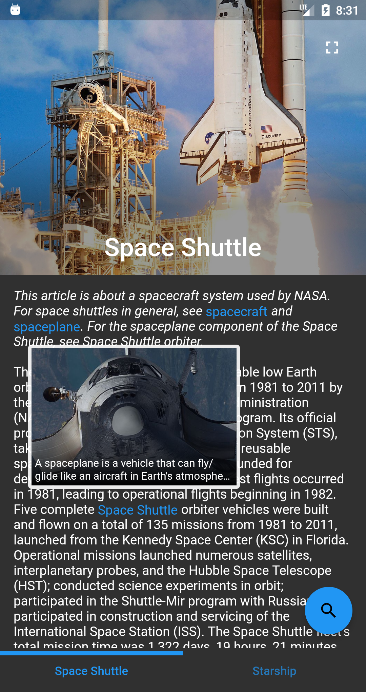
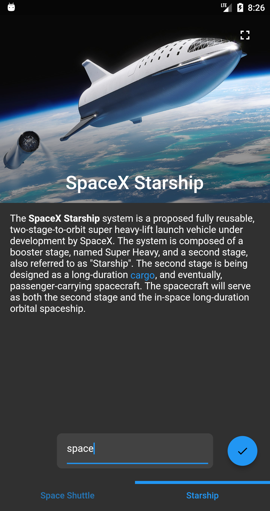

# max_clean_arch

Clean Architecture + BLoC + RxDart + Injectable (Flutter app proposal)
---

The app allows navigating through the content fetched from an API endpoint.
The content is composed by multiple articles related to a common topic
(e.g., music, spacecraft, computers, etc.).  
The apps starts with dummy data. After, the app is possible
to feed different data sets into the app entering ID to fetch the content from a service API
using FAB (in the bottom right corner).

  

  

**TODO**
- complete with tests  
- add logging library to trace calls of services, repos, use-cases, bloc events, ...  
- analyze and fix with # flutter analyze  
- add GitHub actions for testing, formatting, and analyzing
- show more detailed and localized messages of API failures (when no network or a bad server response, etc.)  

----------------------

Best regards, 
Max Shemetov 

2021 - 2022
